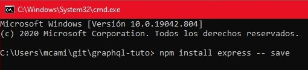
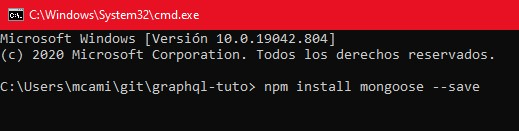
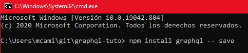
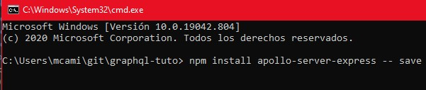
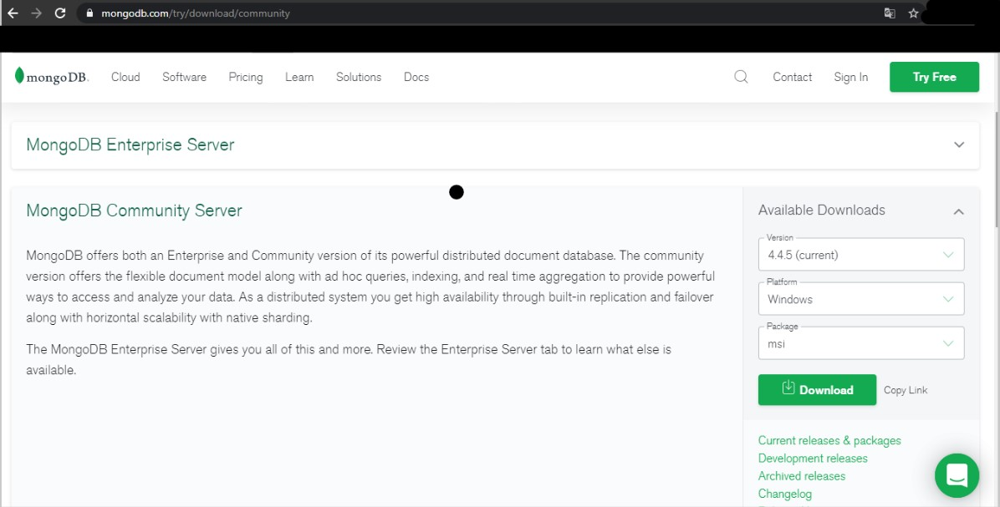
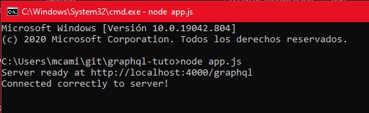
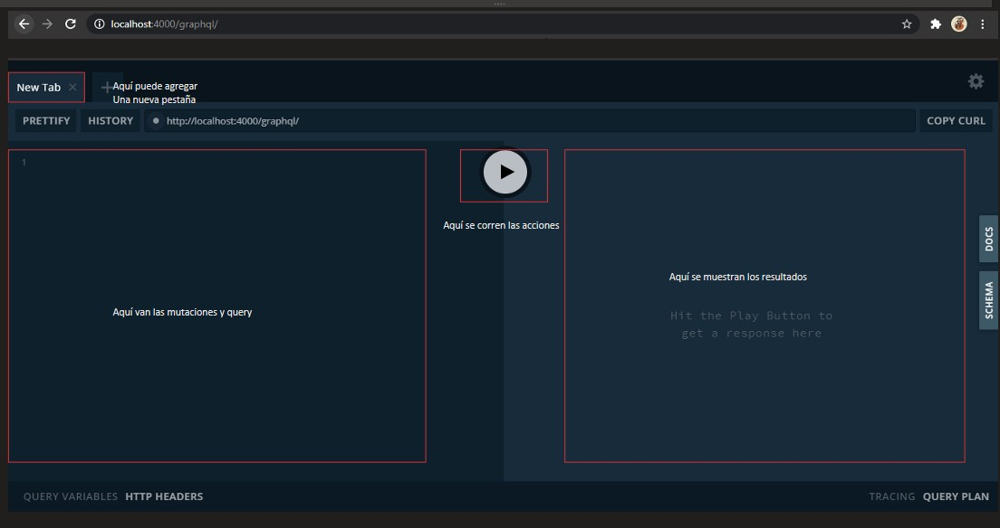
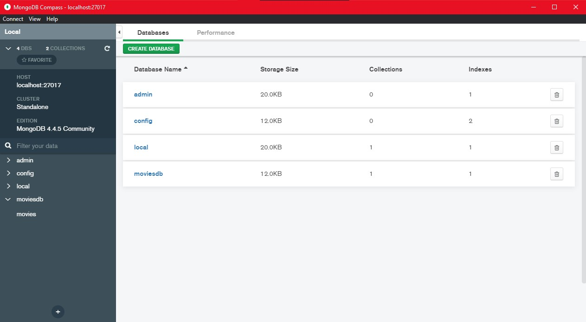
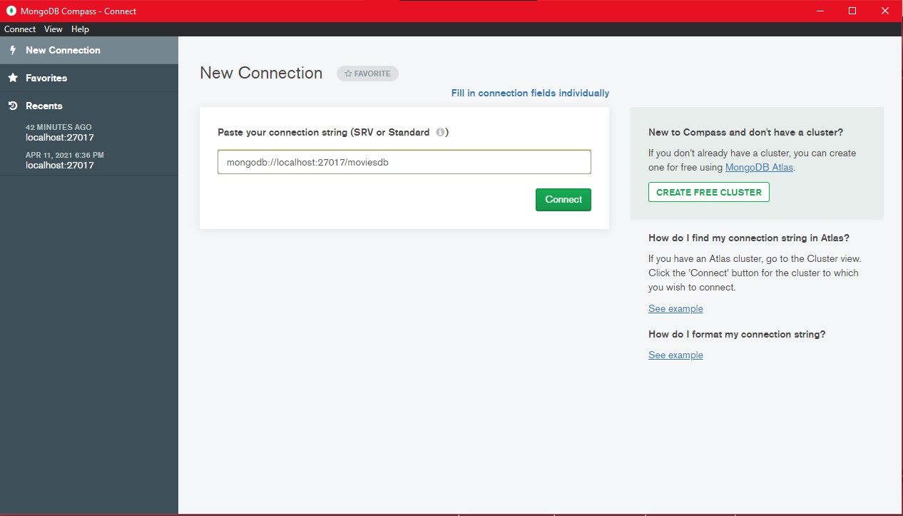
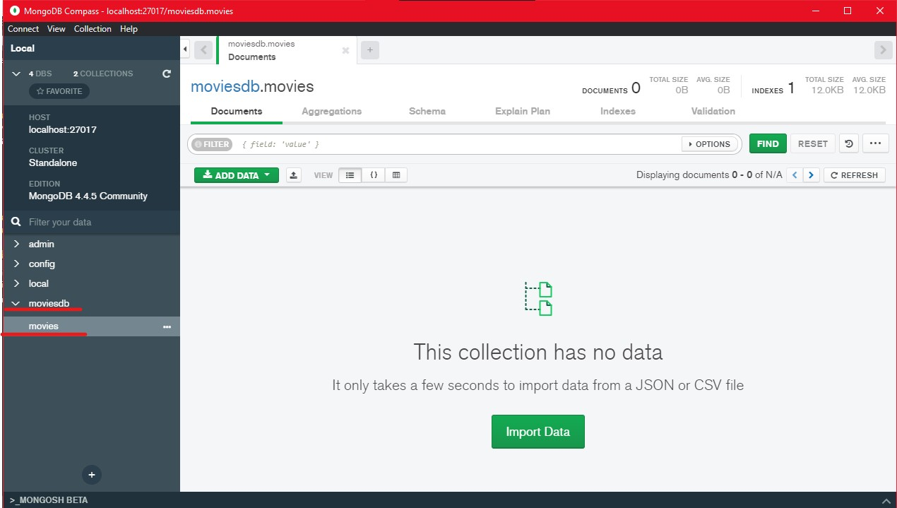

# graphql-tuto
<html>
<h1 align="center"> Tutorial GraphQl </h1>
<dl>
<dt><em> 1. Integrantes </em></dt>
	 
	<dd><b>1.1</b>. Nicolás Peña Mogollón</dd>
	<dd><b>1.2</b>. María Camila Lozano Gutierrez</dd>
	 
<dt><em> 2. Link del repositorio de github para clonar</em></dt>
	 
	<dd>https://github.com/Nicolas-Pena-Mogollon/graphql-tuto.git</dd>
	 
<dt><em> 3. Instrucciones de Uso</em></dt>
    <dd	><b>3.1.</b> Primero, clone el repositorio en la ubicación de su preferencia.</dd>
     
    <dd><b>3.2.</b> Usando la consola o terminal, descargue las siguientes librerias con los
    siguientes comandos en la ubicación del proyecto: </dd>
       <dd><b>-</b> npm install express -- save </dd>
        
       
        
        
       <dd><b>-</b> npm install mongoose -- save </dd>
         
       
        
        
       <dd><b>-</b> npm install graphql -- save </dd>
         
       
        
        
       <dd><b>-</b> npm install apollo-server-express -- save </dd>
         
       
        
     
    <dd><b>3.3.</b> Descargue MongoDB en el siguiente link:
    <dd><b>-</b> https://www.mongodb.com/try/download/community</dd>
     
       
        
        
    </dd>
    <dd><b>3.4.</b> Cuando termine de instalar las librerias, escriba en la consola (en la ubicación
    del archivo):</dd>
    <dd><b>-</b>  node app.js </dd>
     
       
        
        
    <dd><b>3.5.</b> Dirijase a la siguiente url en su navegador:</dd>
    <dd><b>-</b> http://localhost:4000/graphql/ </dd>
     
       
        
        
    <dd><b>3.6.</b> Abra MongoDB en su computador para poder revisar la información que queda en la
    base de datos. </dd>
     
       
        
        
    <dd><b>3.7.</b> Copie y pegue la siguiente ruta mongodb://localhost:27017/moviesdb en MongoDB e
    ingrese a la pestaña lateral moviesdb -> movies</dd>
     
    
        
        
    
        
        
    <dd><b>3.8.</b> En el url que pego en el navegador puede realizar las operaciones (mutaciones):
    addMovie, updateMovie y deleteMovie. Y peticiones (query): getMovie y getMovies. </dd>
</dl>
</html>
    